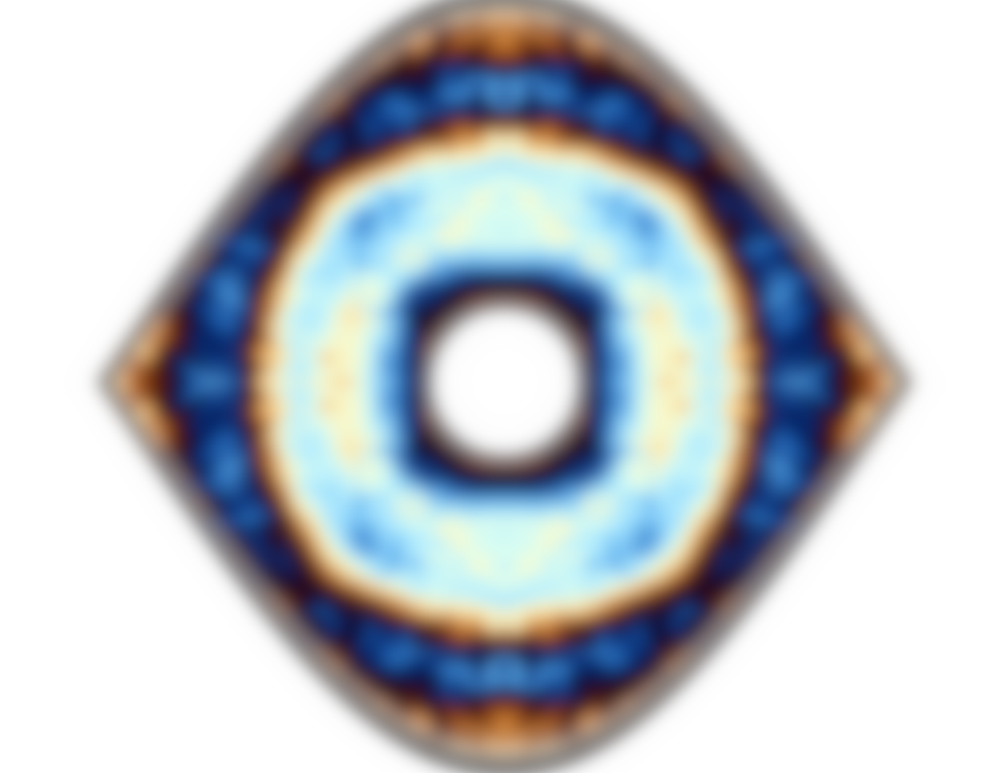

# PataNode - Node-Based Shader Editor



**PataNode** is a powerful node-based shader editor designed for creating real-time audio-reactive visuals. Built with PyQt5 and ModernGL, it provides an intuitive interface for building complex shader programs through a visual node graph system.

## Features

### 🎨 Visual Shader Programming
- **Node-based interface** for creating shader programs without writing code
- **70+ built-in shader nodes** including colors, effects, textures, and transformations
- **Real-time preview** with immediate feedback
- **Multi-window MDI interface** for managing multiple shader graphs

### 🎵 Audio Reactive Visuals
- **Real-time audio analysis** with feature extraction
- **Beat detection** for kick, snare, and hat sounds
- **Audio feature mapping** to shader parameters
- **Audio engine** with configurable processing pipeline

### 💡 Light Control Integration
- **Light engine** for controlling external lighting systems
- **Color synchronization** between visuals and lights
- **ArtNet support** for professional lighting control

### 🌐 Network Capabilities
- **Built-in server mode** for remote control
- **Network synchronization** of parameters
- **Multi-device coordination** for live performances

### 🔧 Professional Tools
- **Scene management** with save/load functionality
- **Mapping system** for LED and projection mapping
- **Particle systems** and physics simulations
- **Transition effects** for smooth scene changes

## Architecture

```
PataNode Architecture
├── Core Application (app.py)
├── Node Editor Framework (nodeeditor/)
├── Shader Programs (program/)
│   ├── Base programs
│   ├── Colors & effects
│   ├── Textures & patterns
│   ├── Transitions
│   └── Particle systems
├── Audio Processing (audio/)
├── Light Control (light/)
└── Network Server (server/)
```


## Installation

```bash
# Install dependencies using UV
uv pip install -r requirements.txt

# Run the application
uv run main.py
```

## Development

### Project Structure
- `app.py` - Main application class
- `gui/` - User interface components
- `node/` - Node definitions and base classes
- `program/` - Shader program implementations
- `audio/` - Audio processing pipeline
- `light/` - Light control system
- `server/` - Network server functionality

## Depth camera (optional)

The Depth Input node streams from an Orbbec Gemini 2. The camera is optional —
without it the node renders transparent black and the app runs normally.

`pyorbbecsdk` is **not** in `pyproject.toml`. It is not on PyPI, and building
from source is broken (the upstream git-LFS remote is missing objects). Install
the prebuilt wheel instead. For Python 3.11 on linux x86_64, download
`pyorbbecsdk2-2.1.1-cp311-cp311-linux_x86_64.whl` from
https://github.com/orbbec/pyorbbecsdk/releases and:

```bash
.venv/bin/python -m pip install pyorbbecsdk2-2.1.1-cp311-cp311-linux_x86_64.whl
sudo sh .venv/lib/python3.11/site-packages/pyorbbecsdk/shared/install_udev_rules.sh
```

The package is named `pyorbbecsdk2` but imports as `pyorbbecsdk`. Replug the
camera after installing the udev rules.

**The Gemini 2 must be on a USB 3.0 port.** On a 480M link it drops off the bus
mid-enumeration with `Input/Output Error`. Check with `lsusb -t` — the Orbbec
line must read 5000M or 10000M. A USB-2 or charge-only cable also forces 480M.

To develop without hardware, run with a fake camera:

```bash
.venv/bin/python main.py --depth-source synthetic
```
